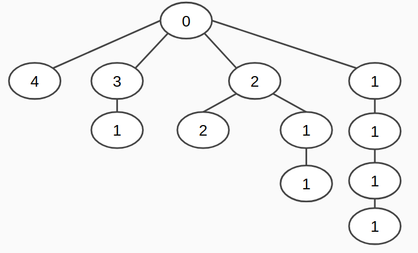

# Midterm 2 Review

## Question 1

Draw box & pointer diagram for:

```python
a = [1,2,3,4,5]
b = [a.append([a.pop(0)]) for _ in range(2*len(a))]
c = [[a[i]] + [b[i]] for i in range(len(a))]
```

Recall:

`lst.pop(i)` removes the `i`th index from the list and returns it

```python
>>> lst = [6, 4, 8]
>>> lst.pop(1)
4
>>> lst
[6, 8]
```

## Question 2

Finish implementing this `Link` class:

```python
class Link:
  empty = ()
  
  def __init__(self, first, rest=Link.empty):
    self.first = first
    self.rest = rest
    
  def copy(self):
    """
    Returns a copy of the linked list
    """
    if self.rest == Link.empty:
      return Link(self.first)
    return Link(self.first, self.rest.copy())
    
  def __len__(self):
    """
    >>> lst = Link(1, Link(2, Link(3)))
    >>> len(lst)
    3
    """
    return 1 + len(self.rest)
    
    
  def __add__(self, other):
    """ Note that these should be copies
    >>> lst1 = Link(1, Link(2, Link(3)))
    >>> lst2 = Link(4, Link(5, Link(6)))
    >>> lst1 + lst2
    Link(1, Link(2, Link(3, Link(4, Link(5, Link(6))))))
    """
    if self.rest == Link.empty:
      return Link(self.first, other.copy())
    return Link(self.first, self.rest + other)
```

## Question 3

```python
def knapsack(items, weight):
  """
  You must return the maximum weight can be put
  into the knapsack with the requirements that 
  - the total weight is less weight
  - each item is used once
  - list of items is a list of number corresponding to weights
  - should be done recursively
  
  >>> knapsack([5,3,7], 10)
  10     # 3 + 7
  >>> knapsack([7,2,5,9], 13)
  12     # 7 + 5
  """
  if len(items) == 0 or weight == 0:
        return 0

  if items[0] > weight:
    return knapsack(items[1:], weight)

  with_0 = items[0] + knapsack(items[1:], weight - items[0])
  without_0 = knapsack(items[1:], weight)

  return max(with_0, without_0)
```

## Question 4

``` python
class Shmoe:
  w = {}
  def __init__(self, x, y):
    if x in Shmoe.w:
      Schmoe.w[x].append(y)
      self.a = x * y
      self.s = Joe(self.a, 0)
      print(Shmoe.w)
    else:
      Schmoe.w[x] = [y]
      print('Wowie')
    
  def moe(self, h):
    
    def f(x):
      nonlocal h
      h = h*self.a
      return Joe(h, h)
    return f

class Joe(Shmoe):
  def __len__(self):
    return len(Shmoe.w[self.a])
 
```

What would python display? (for objects put: <Joe Object> or <Shmoe Object> if displayed, as well as for simplicity you can write `'hi'*3` instead of `'hihihi'`)

```python
>>> a = Shmoe('hi', 3)
Wowie
>>> b = Shmoe('hi', 2)

Wowie
{'hi'*2: [0], 'hi': [3, 2]}

>>> d = Shmoe(9, 9)

Wowie

>>> c = b.moe(3)
>>> c(5)

Wowie
<Joe object>

>>> e = Joe(1, 3)

Wowie

>>> f = e.moe(3)
>>> f(3)

Error: 'Joe' object has no attribute 'a'

>>> g = Shmoe(1, 3)

Wowie
{1: [3, 3], 3: [0], 9: [9], 'hi'*6: ['hi'*6], 'hi'*2: [0], 'hi': [3, 2]}

>> g.moe(3)(3)

Wowie
{1: [3, 3], 3: [0], 81: [0], 9: [9, 9], 'hi'*6: ['hi'*6], 'hi'*2: [0], 'hi': [3, 2]}
<Joe object>
```

## Question 5 (Difficult)

Create a function that constructs a tree contains all of the possible partitions starting at n. 

In other words, any path from root to leaf must sum to n

Example: `tree_partitions(4)`



```python
def tree_partitions(n):
    """Returns a tree with each of the top level branches corresponding to a
    partition of n.
    >>> tree_partitions(1)
    Tree(0, [Tree(1)])
    >>> tree_partitions(2)
    Tree(0, [Tree(1, [Tree(1)]), Tree(2)])
    >>> tree_partitions(3)
    Tree(0, [Tree(1, [Tree(1, [Tree(1)])]), Tree(2, [Tree(1)]), Tree(3)])
    """
    assert n > 0
    def helper(n, m):
        if n == m:
            return Tree(m)
        b = []
        for k in range(1, min(n - m + 1, m + 1):
          b += [helper(n - m, k)]
        return Tree(m, b)
    return Tree(0, [[helper(n, m) for m in range(1, n+1)]])
```

